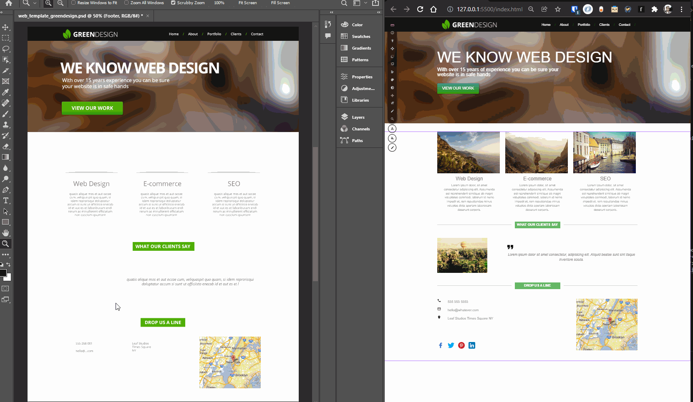

# Web-page mock-up form Photoshop template

<html>
<!-- Project Shields -->
    

        
		  ¨
        
        ¨
        
        ¨
        
        ¨
        
    
 
</html>

### Web-site build process based on Photoshop template.

#### By Roman Kolivashko

## Technologies Used

* _HTML_
* _CSS_
*_Adobe Photoshop_

## Description
This project was created to document website creation based on photoshop mock-up template.

## Setup/Installation Requirements

1. Click on "Code" button at top of GitHub repository. 
2. Clone the repository: `$ git clone https://github.com/romankolivashko/psdToHtml.git`
3. Navigate to the psdToHtml/ directory on your computer
4. Launch index.html in any browser 

## How to access the site from the web
* Follow the link [here](https://stoic-gates-2c71b0.netlify.app/)
## Known Bugs

* _None so far_

## License
MIT
## Contact Information
rkolivashko@gmail.com